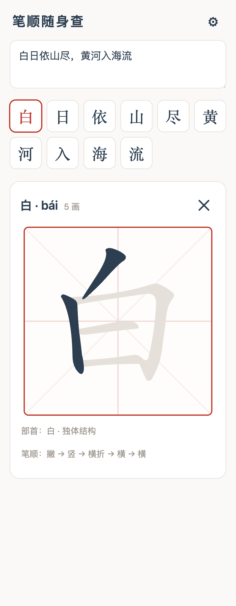
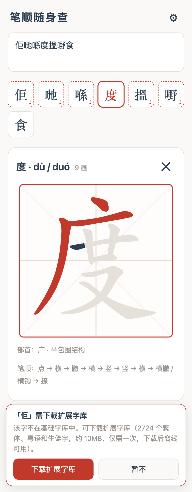
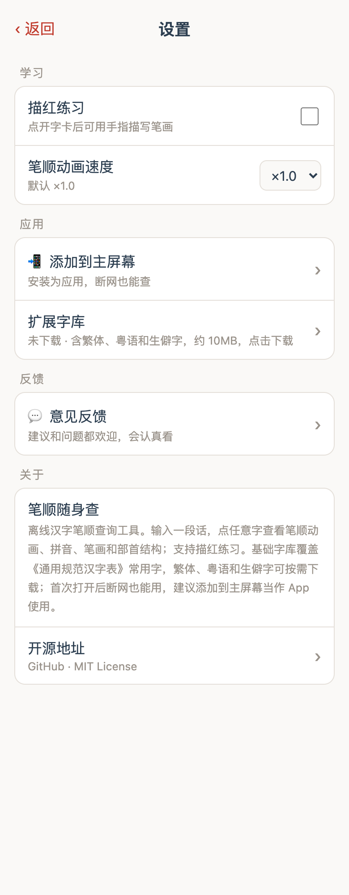

# 笔顺随身查 Bishun

> 整段识别 · 点字看笔顺 · 离线可用 — 别人逐字查，这里粘贴一段话，点哪个字看哪个字

[English](./README.en.md) | **在线体验：https://dezhaohe.github.io/bishun/**

<p align="center">
  
  
  
</p>

不同于逐字联网查询的笔顺网站，本工具把整段文本一次拆成字卡，点哪个字就看哪个字的笔顺，**首次打开后完全离线可用**，适合添加到手机主屏幕当作独立应用。

## ✨ 功能

- **整段输入**：粘贴任意文本，自动提取汉字并去重成可点击字卡
- **笔顺动画**：米字格中循环演示，部首标红，速度 ×0.5 / ×1 / ×2 可调
- **汉字信息**：拼音（含多音字）、笔画数、部首、字形结构（左右/上下/包围…）、笔顺名称（横 → 竖 → 撇 …）
- **描红练习**：可选开启（设置 ⚙ 中），手指沿轮廓逐笔描写，写错提示重画
- **完全离线**：Service Worker 预缓存约 20MB 笔顺数据（gzip 传输约 8MB，仅首次下载）
- **字库**：《通用规范汉字表》8105 字中有笔顺数据的 6866 字，覆盖日常文本 99.9% 以上
- **扩展字库按需下载**：点到繁体、粤语或生僻字时提示一键下载扩展包（2724 字，约 10MB），下载后同样离线可用，不拖累首次体验
- **粤语字支持**：哋咗佢冇嗰喺搵攞等常用香港粤语字（开源数据源均未覆盖，本项目用真实字形部件合成笔顺数据并标注粤拼，见 `scripts/canto.mjs`）

## 📱 手机安装（推荐）

1. 手机浏览器打开 https://dezhaohe.github.io/bishun/
2. iOS Safari：分享 → **添加到主屏幕**；Android：不同品牌手机（小米/OPPO/vivo/华为/三星…）应用内会给出对应浏览器的操作提示
3. 从主屏幕图标打开即是全屏应用，断网可用（建议首次在 WiFi 下打开完成缓存）

> 从微信 / QQ / 微博等 App 内打开时无法直接添加到主屏幕（这是系统限制），应用会提示"复制链接"，粘贴到系统浏览器（Safari / Chrome 等）打开后再添加。

## 🚀 本地开发

```bash
git clone https://github.com/dezhaohe/bishun.git
cd bishun
npm install
npm run dev       # 开发服务器（自动先生成笔顺数据）
npm run build     # 构建到 dist/
npm run preview   # 预览构建产物（含 Service Worker）
```

要求 Node.js ≥ 18。

## 🔧 自己部署一份

`dist/` 是纯静态产物，任何支持 HTTPS 的静态托管都能用（GitHub Pages、Vercel、Cloudflare Pages、自建 Nginx…）。Service Worker 要求 HTTPS（localhost 除外）。

Fork 本仓库后想部署到自己的 GitHub Pages：把 `package.json` 里 `deploy` 脚本中的仓库地址改成你自己的，然后 `npm run deploy`。

## 🗂 项目结构

```
├── index.html              # 入口（含 PWA / iOS meta）
├── src/
│   ├── main.ts             # 全部应用逻辑（~250 行）
│   └── style.css           # 移动优先样式
├── scripts/
│   ├── gsc-chars.json      # 《通用规范汉字表》8105 字
│   └── build-data.mjs      # 构建时从 hanzi-writer-data 提取合并笔顺数据
├── public/                 # 图标等静态资源（data/ 为生成产物，不入库）
└── vite.config.ts          # Vite + vite-plugin-pwa 配置
```

**裁剪字库**：默认打包全量规范字（约 19.5MB）。字表按一级 → 二级 → 三级排序，构建时设置 `CHAR_LIMIT` 即可裁剪，例如只保留 3500 个一级常用字（数据降到约 9MB）：

```bash
CHAR_LIMIT=3500 npm run build
```

## 🙏 数据来源与致谢

| 项目 | 用途 | 许可 |
|---|---|---|
| [Hanzi Writer](https://github.com/chanind/hanzi-writer) | 笔顺动画与描红渲染 | MIT |
| [hanzi-writer-data](https://github.com/chanind/hanzi-writer-data) / [Make Me a Hanzi](https://github.com/skishore/makemeahanzi) | 笔顺 SVG 数据 | [Arphic Public License](./ARPHICPL.TXT) |
| [cnchar](https://github.com/theajack/cnchar) | 拼音 / 笔画名 / 部首 / 结构 | MIT |
| [通用规范汉字表](https://github.com/jaywcjlove/table-of-general-standard-chinese-characters) | 字表 | MIT |

## 📄 许可

代码以 [MIT](./LICENSE) 发布；打包的笔顺数据源自文鼎科技（Arphic Technology）1999 年开放的字库，遵循 [Arphic Public License](./ARPHICPL.TXT)。
